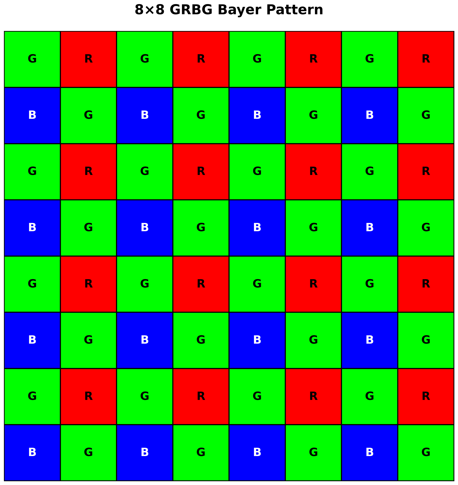

# Color Filter Array Demosaicking Using High Order Interpolation Techniques with a weighted Median Filter for Sharp Color Edge Preservation

## Introduction

-  Demosaicking is a digital process to obtain full color images from images captured by a single image sensor.
-  Single Image Sensor does not capture the full red , green , blur color planes.
-  It contain specific color fiter which captures a particular color wavelength and there are different patterns to it.
-  The pattern is called Bayer Pattern eg , BGGR , RGGB , GRBG etc. Repeated across the whole image.
-  The process of recovering the missing colors at a pixel position is called Demosaicking / Debayering.

## Algorithm

- It consists of two stages /
    - First Stage - Interpolation algorithm is used to determine four estimates of the missing color value for four different direction.
    - Second Stage - Classifier is used to determine the output ? (make it explanatory)

- High Order Extrapolation
    - Approach behind the algorithm
        - When there is an edge , only pixels on the same side of the edge should be used for extrapolation.
        - Interpolation from both sides of the edge will cause blurring. Use the samples for only from one side of the edge
            either left or right.
        - There is spectral correlation between the green and Red/Blue pixels within a local neighborhood. We could use the Red/Blue pixels in the neighborhood to determine the missing green channel.
    
    - Based on the bayer pattern , each missing green value is surrounded by four know green values located in the left , right , top and bottom directions.
    - The Green plane is extrapolated first as it contains the most samples. 
    - Forumala - $G(x) = G(x-1) + \frac{3}{4}\big(B(x) - B(x-2)\big) - \frac{1}{4}\big(G(x-1) - G(x-3)\big) - (1)$  
- High Order Interpolation
    - Assumption - Nearest known samples in a 2D plane to the missing value contains the most accurate information about that missing sample.
    - If one sample from the other side of the missing sample will produce a more accurate estimate if is along an edge.
    - Interpolate across the center to obtain more accurate estimates
    - Formula - $G(x-1) = G(x-1) + \frac{1}{2}\big(B(x) - B(x-2)\big) - \frac{1}{8}\big(G(x+1) - 2G(x-1) + G(x-3)\big) - (2)$

    - Look closely at equation $(1)$ and $(2)$
        - weights of $(B(x) - B(x-2))$ and $(G(x-3))$ has been reduced.
        - $G(x+1)$ is introduced into the equation.
        - Both $B(x-2)$ and $G(x-3)$ are further away from the sample pixel. It makes sense to decrease their weights in the equation.
        - $G(x+1) is closer to the sample pixel and increasing the weight will produce a more accurate estimate.
        - Based on the presumption that the nearer sample contains more accurate information about the sample to be estimated when there is no edge.

- Formula representation in Bayer Pattern
    - 
